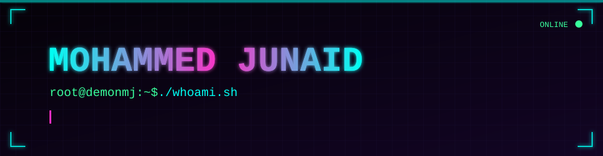
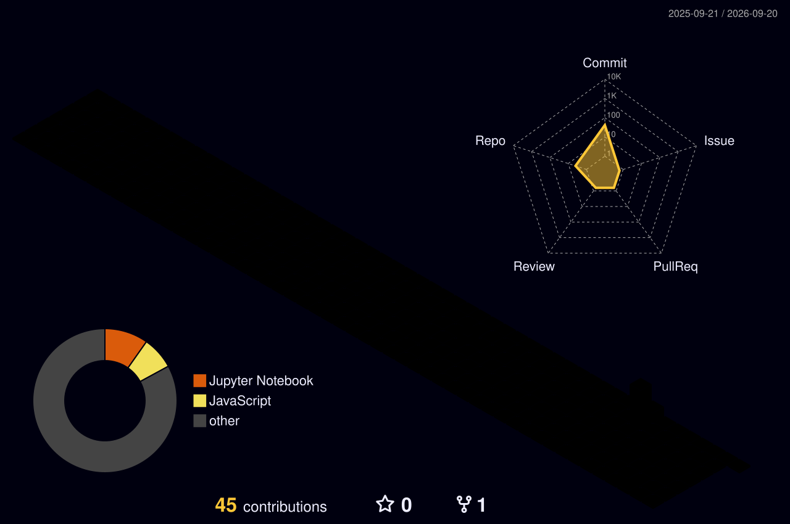

<div align="center">




</div>

<br/>

<div align="center">

<!-- 🖨️ profile photo "printing" out of a terminal — see assets/profile-printing.svg -->


</div>

<br/>

<div align="center">

[](mailto:mohammed.ju2006@gmail.com)
[](https://www.linkedin.com/in/mohammed-junaid2006/)
[](https://github.com/demonmj)

</div>

<br/>

## `> whoami`

```yaml
name: Mohammed Junaid
role: B.Tech Computer Science student
focus: [Cybersecurity, Ethical Hacking, Cloud Security, DevSecOps]
status: "learning by building — AI/ML pipelines, full-stack systems, security fundamentals"
```

- 🎓 B.Tech Computer Science student
- 🔐 Focused on **Cybersecurity & Ethical Hacking**
- ☁️ Targeting **Cloud Security Engineering** and **DevSecOps** as primary career paths
- 🧪 Learning by building — AI/ML pipelines, full-stack systems, and security fundamentals

<br/>

## `> stack --list`

<div align="center">

</div>

<br/>

## `> currently_building_toward`

<div align="center">


</div>

<br/>

## `> ls ./featured_projects`

<div align="center">

<a href="https://github.com/demonmj/Bangalore-Traffic">
  
</a>
<a href="https://github.com/demonmj/Pothole_Detection">
  
</a>

</div>

<br/>

## `> cat ./stats.log`

<div align="center">


</div>

<div align="center">


</div>

<br/>

## `> render ./contribution_grid --mode=3d`

<div align="center">

<!-- generated by .github/workflows/profile-3d.yml -->


</div>

<br/>

## `> ./contribution_snake.sh --loop`

<div align="center">

<!-- generated by .github/workflows/snake.yml -->
<picture>
  <source media="(prefers-color-scheme: dark)" srcset="https://raw.githubusercontent.com/demonmj/demonmj/output/github-snake-neon.svg"/>
  <source media="(prefers-color-scheme: light)" srcset="https://raw.githubusercontent.com/demonmj/demonmj/output/github-snake-neon.svg"/>
  
</picture>

</div>

<br/>

## `> cat ./isometric_metrics.svg`

<div align="center">

<!-- generated by .github/workflows/metrics.yml -->


</div>

<br/>

<div align="center">

</div>
