    

  

  

 
 

 

## 🧬 About Me

- 🎓 B.Tech Computer Science student
- 🔐 Focused on **Cybersecurity & Ethical Hacking**
- ☁️ Targeting **Cloud Security Engineering** and **DevSecOps** as primary career paths
- 🧪 Learning by building — AI/ML pipelines, full-stack systems, and security fundamentals

 

## 🛠️ Tech Stack

 

## 📡 Currently Building Toward

 

## 🚀 Featured Projects

<table>
<tr>
<td width="50%" valign="top">

### 🚦 [Bangalore-Traffic](https://github.com/demonmj/Bangalore-Traffic)

A data-driven traffic navigation system that provides real-time insights into Bengaluru traffic conditions, enabling efficient route planning and enhanced urban mobility.

</td>
<td width="50%" valign="top">

### 🕳️ [Pothole_Detection](https://github.com/demonmj/Pothole_Detection)

AI-powered pothole detection & road severity classification — a YOLOv8 + OpenCV pipeline that detects potholes, rates severity, geotags location, and plots results on an interactive map.

</td>
</tr>
</table>

 

## 📊 GitHub Stats

 

## 📈 Activity Overview

 

